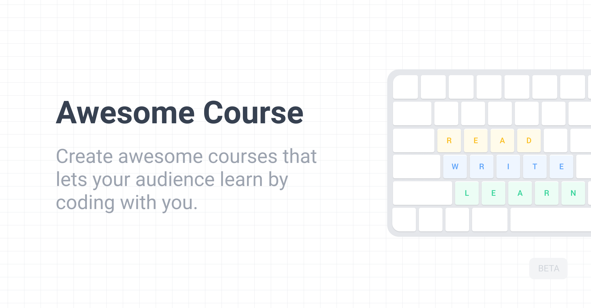

Create awesome courses that let your audience learn by coding.

### Why?

As a developer, to learn a new software technology, we mostly start reading a document about it. Good to start. Then we are trying to find other resources for advanced topics and watch video courses. Video courses might be wasting time. To learn something, we need to get our hands dirty; code. **Awesome Course lets you learn any course by coding directly.**

As a content creator, making video courses is exhausting. Filming, editing, camera, microphone, all the details are important to be good at that. Do you really care that your audience learns from your content? **Awesome Course let you create courses that your audience learn by coding.**

#### Example Course

Want to see how does Awesome Course work? Try my demo [Testing JavaScript](https://www.awesomecourse.dev/lesson/1) course.

### Features

- Ready to use without development 🚀
- Supports dark/light mode 🌗
- Written in TypeScript

### Todo

- [x] Start and Completed pages
- [x] Responsiveness for course detail pages
- [x] CLI support to easly create an awesome course
- [ ] Overview page to see all lessons and chapters
- [ ] Documentation with Docusaurus
- [ ] Demo course - TDD with React
- [ ] New sections on landing page
- [ ] Multi language for courses
- [ ] Settings for customize workspace UI (such as editor theme etc.)

### Ideas

- [ ] Authorization to create courses online
- [ ] Marketplace to list and share courses

### Getting Started

Want to create an Awesome Course? Check out [the documentation website]().

### LICENCE

[MIT](./LICENCE)

### Show Your Support

Please give a star if you like this project! 🤩
